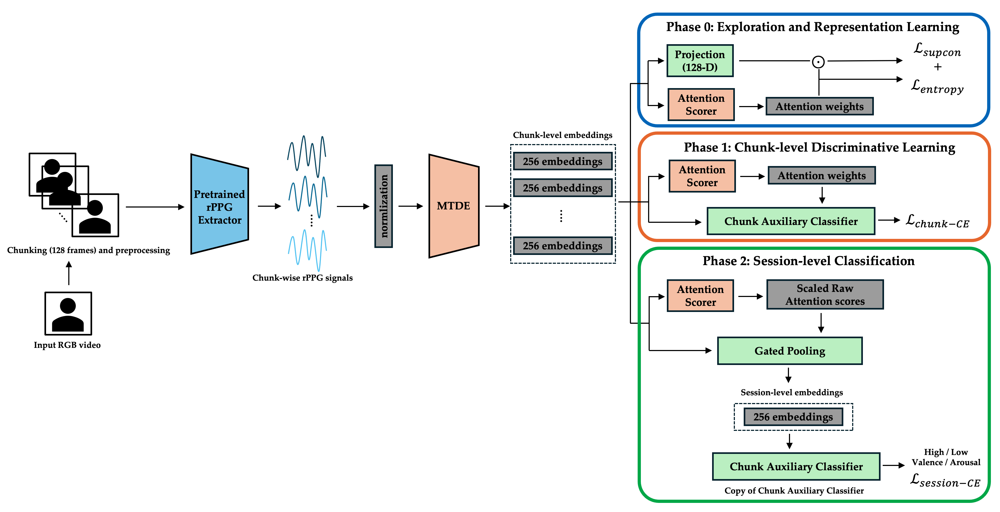

# Emotion Recognition from rPPG via *Physiologically-Inspired Temporal Encoding and Attention-based Curriculum Learning*
> UNDER REVIEW at special issue of MDPI Sensors(Sensing and Imaging; Emotion Recognition and Cognitive Behavior Analysis Based on Sensors)


[]()
[]()

---

## 📋 Contents

1. [Overview](#overview) 
2. [Quick Start](#quick-start) 
3. [Model Flow](#model-flow) 
4. [Training Curriculum](#training-curriculum) 
5. [Cite Us](#how-to-cite) 
6. [License](#license) 
7. [Detailed Docs](#detailed-docs)

---

## 📝 Overview

End-to-end **phase-aware** emotion recognition on top of [rPPG-Toolbox](https://github.com/ubicomplab/rPPG-Toolbox).
Three phases (explore → chunk-refine → session-finetune) within **50 epochs**.

---

## 🚀 Quick Start

<details>
<summary> Setup </summary>
You can use either [`conda`](https://docs.conda.io/projects/conda/en/latest/user-guide/install/index.html) or [`uv`](https://docs.astral.sh/uv/getting-started/installation/).
Most users are already familiar with `conda`, but `uv` may be a bit less familiar - check out some highlights about `uv` [here](https://docs.astral.sh/uv/#highlights). If you use `uv`, it's highly recommended you do so independently of `conda`, meaning you should make sure you're not installing anything in the base `conda` environment or any other `conda` environment. If you're having trouble making sure you're not in your base `conda` environment, try setting `conda config --set auto_activate_base false`.
</details>

```bash
git clone https://github.com/LeeChangmin0310/ReMOTION-Temporal.git
cd ReMOTION-Temporal
bash setup.sh conda          # or: bash setup.sh uv
conda activate remotion

# train / validate / test
python main.py --config configs/train_configs/Arsl_BC_Normal_PHYSMAMBA.yaml
```
<details>
<summary> NOTE </summary>
The above setup should work without any issues on machines using Linux or MacOS. If you run into compiler-related issues using `uv` when installing tools related to mamba, try checking to see if `clang++` is in your path using `which clang++`. If nothing shows up, you can install `clang++` using `sudo apt-get install clang` on Linux or `xcode-select --install` on MacOS.

If you use Windows or other operating systems, consider using [Windows Subsystem for Linux](https://learn.microsoft.com/en-us/windows/wsl/install) and following the steps within `setup.sh` independently.
</details>

---

## 🧬 Model Architecture Flow

<p align="center"></p>


### Phase-by-Phase (0–14 | 15–29 | 30–49)

| Phase | Epochs |            Core Losses           |          Main Goal          |
| :---: | :----: | :------------------------------: | :-------------------------: |
|   0   |  0–14  |       SupConTopK + Entropy       | Diverse temporal embeddings |
|   1   |  15–29 | Focal Chunk-CE (+0.2 Session-CE) |    Chunk discriminability   |
|   2   |  30–49 |         Session-CE (only)        |  Stable session classifier  |


---

## 🎯 Training Curriculum (50 Epochs)

| Phase | Epochs |       Attention Kernel       |               Main Losses (weights)               |        Trainable Blocks        |
| :---: | :----: | :--------------------------: | :-----------------------------------------------: | :----------------------------: |
|   0   |  0–14  | softmax → α-entmax (1.0→1.4) |        SupCon 0.50 • Entropy λ (0.05→≤0.20)       |  MTDE, AttnScorer, Projection  |
|   1   |  15–29 |      α-entmax (1.4→1.6)      | Chunk-CE 0.30→1.0 • SupCon 0.10 • Session-CE 0.20 | +ChunkAux, Pooling, Classifier |
|   2   |  30–49 |          raw scores          |   Session-CE 1.0 (Classifier LR ×2 for 6 epochs)  |    MTDE, Pooling, Classifier   |

---

## 📁 Detailed Docs

* [📂 Datasets](docs/datasets.md)
* [🛠️ Model & Loss Details](docs/model_details.md)
* [🔧 Extending the Toolbox](docs/extensions.md)

---

## 📁 How to Cite

```bibtex
@Article{s3658084,
  AUTHOR = {Lee, Changmin and Lee, Hyunwoo and Whang, Mincheol},
  TITLE  = {Emotion Recognition from rPPG via Physiologically-Inspired Temporal Encoding and Attention-based Curriculum Learning},
  JOURNAL = {Sensors},
  VOLUME = {25},
  YEAR = {2025},
  NUMBER = {},
  ARTICLE-NUMBER = {},
  URL = {},
  ISSN = {1424-8220},
  DOI = {}
}
```

---

## 🛡️ License

Inherited from the original rPPG-Toolbox — Responsible AI License.
